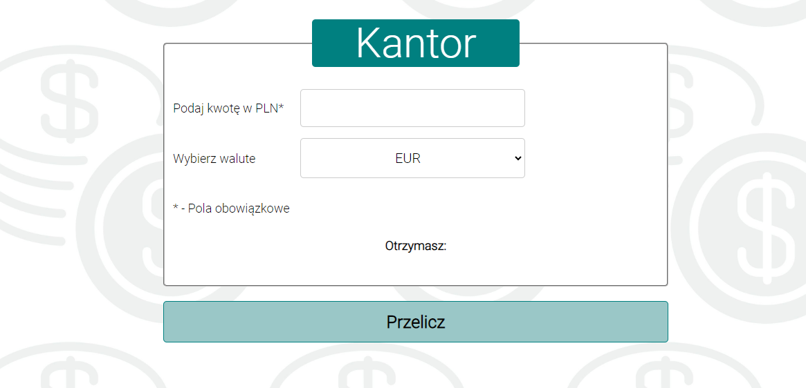

# Cantor
 ## **Hi!** I am **Kacper** and this is my **cantor!** 
# [Converter-React - Link](https://pepko0.github.io/converter-react/)

## Page look


## I used:
- JavaScript
- HTML 
- CSS 
- React 
- BEM 

## On this page You can check How much will you have:
- USD
- EUR
- GBP
- JPY

## Exchange rate: 
```Java Script
const USD = 4.24;
const EUR = 4.53;
const GBP = 5.27;
const JPY = 0.03;
```
### **Everything is calculated for the amount given in PLN**

## This is how look website on the social media:


## This is how the page works 
[](https://postimg.cc/BjRsT052)

## Link to my website: https://pepko0.github.io/converter-react/
version: **beta**